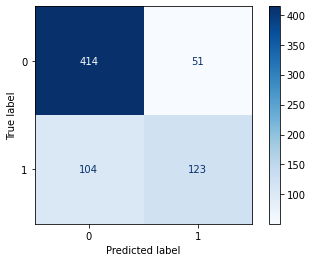
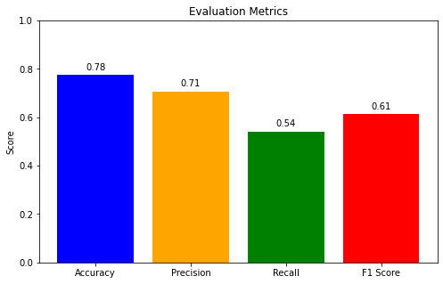
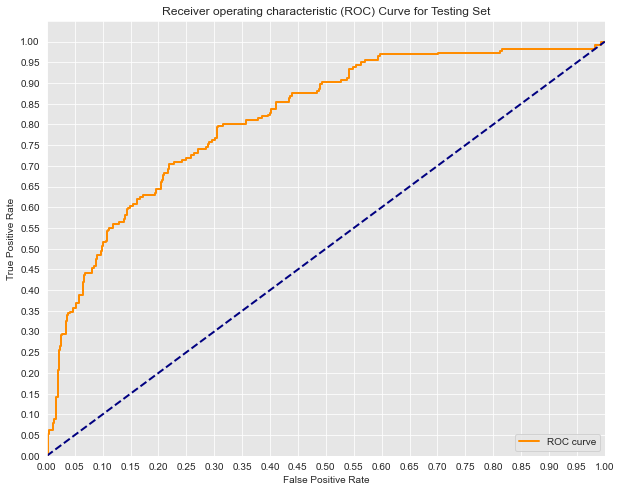

# Diabetes Prediction in Mothers 

## Introduction
Diabetes is a chronic metabolic disease which is characterized by elevated levels of blood sugar, which over time to serious damage to the heart, blood vessels, eyes, kidneys and nerves.
There are two types of of diabetes type 1 and type 2 diabetes.
Type 2 diabetes is when the body becomes resistant to insulin or doesn't make enough insulin.
Type 1 diabetes is when the pancreas produces little or no insulin by itself.

## Business Understanding

### Background

In introduction we were briefly intoduced to what diabetes is and the most common types of diabetes which is type 1 and type 2 diabetes.
In this section, we will further undertand what type of diabetes mostly affect pregnant mothers or women who have children already and the effect on their children.
First we look at diabetes that affect mothers and pregnant women and its effect on the children:

1. Gestational diabetes

This a form of diabetes that occurs when the blood sugar levels become elevated during pregnancy between the 24th and 28th weeks of pregnancy.
It is caused by hormonal changes during pregnancy that interfere with the body's ability to produce or use insulin.

Risk factors:

a. Overweight

b. Family history of diabetes

c. Age over 25

d. Certain ethnicities

Risks for the mother:

 a. Increased risk of preeclampsia (a serious condition   affecting blood pressure)

 b. Higher chance of cesarean section

 c. Increased risk of type 2 diabetes later in life  

  Risks for the baby:
  
a. Macrosomia(baby is born significantly larger than average)

b. Hypoglycemia after birth(the blood sugar level drops too low)

c. Increased risk of respiratory distress syndrome

d. Higher risk of developing type 2 diabetes

2.  Type 1 diabetes

This is an autoimmune condition where the body's immune system attacks the pancreas.

Risks for the mother:

a. Increased risk of preeclampsia.

b. Higher risk of miscarriage.

c. Increased risk of birth defects.

d. Higher risk of preterm labor.

Risks for the baby:

a. Macrosomia(baby is born significantly larger than average)

b. Hypoglycemia after birth(the blood sugar level drops too low)

c. Increased risk of respiratory distress syndrome

d. Higher risk of developing type 1 diabetes

3. Type 2 diabetes 

A condition characterized by insulin resistance and insufficient insulin production.

Risks for the mother:

a. Increased risk of preeclampsia.

b. Higher risk of miscarriage.

c. Increased risk of birth defects.

d. Higher risk of preterm labor.

Risks for the baby:

a. Macrosomia(baby is born significantly larger than average)

b. Hypoglycemia after birth(the blood sugar level drops too low)

c. Increased risk of respiratory distress syndrome

d. Higher risk of developing type 2 diabetes

### Problem  Statement

As described in the background mothers are at high risk of developing the different forms of diabetes mentioned above and the we have also seen the risks and complications on both mother and child, from factors mentioned such as weight, genetics age and ethnicity.
The challenge is to effectively identify mothers who are high risk of developing diabetes and provide actionable ways for them to manage it and prevent complications during pregnancies.

To address this challenge a logistic regression model can be developed to predict the likelihood of a woman developing diabetes based on relevant features highlighted from the research. This model would enable healthcare providers to identify high-risk individuals early on and offer targeted interventions to improve maternal and child health outcomes.

### Objectives
1.	Create a model that can be used to predict mothers at risk of diabetes based on the features provided in the dataset.

2.	By creating the model will be able to see if it can be used on unseen data to predict women or mothers at risk of diabetes.

3.	By creating the model, it helps us improve early detection of diabetes in mothers and allows us to provide measures to be used to manage the diabetes and prevent complications during pregnancies
.
4.	The model will allow us to prioritize resource allocations in hospitals for mothers who have diabetes and prevent resource wastage on women who do not have diabetes.

5. The model will allow us to better understand the factors influencing the development of diabetes in mothers during and after pregnancy

### Stakeholders and Implications 

1. Healthcare providers

This involves the hospital in general and the general practioners such as gynecologists and obstetricians.
Implication - They can use the model to identify women who are at high-risk of developing diabetes and follow a suitable approach to manage it and prevent complications in function if fall pregnant.

2. Patients

This mainly includes mothers who are at high risk of diabetes or those who have already have diabetes.
Implication - Enables them to be aware of their situation and enable them to manage it outside the hospital with the help of family members. This helps them to prevent complications if they conceive in the future.

3. Health Insurance Companies

Use the model to assess the risk of diabetes-related complications and adjust insurance premiums accordingly.
Implication - The model can help identify populations at high risk for diabetes-related expenses, enabling targeted prevention programs and risk management strategies.

4. Health policy makers

The model enables them to identify the number of women in the area who are at high risk of developing diabetes during or after pregnancy. 
Implication - This can enable them to preserve resources to be allocated in this situation and spread awareness about diabetes in prevention and management programs.

### Conclusion

From the background we have learnt about the different types of diabetes which include gestational diabetes, type 1, type 2 diabetes and the risk and complications implicted on the mothers and the children if not managed or treated properly.
We also discovered a technical of identifying mothers with diabetes by creating a model that can be able to identify women who have diabetes or at high risk of getting it from the ones who do not through certain factors that can cause it.
We also identified different stakeholders of this project and the implications of this project to them

## Data Understanding

### Data Source
The dataset is a healthcare diabetes dataset that was extracted from kaggle https://www.kaggle.com/datasets/nanditapore/healthcare-diabetes.

The importance of this dataset is contains columns such as blood pressure, insulin, glucose, body mass index, number of times of pregnant for a mother as these are factors that can be used to investigate presence of diabetes in an individual depending on the level of each of the factors in the human body.
If the level of glucose is above average this can lead to gestational diabetes in pregnant women and type 2 diabetes.
If the level of insulin is lower than average this can lead to type 1 diabetes.
The dataset enables us to identify the appropriate levels required in terms of the features in dataset to conclude either an individual has diabetes or not.

From the healthcare dataset the features include:

1. Id - a unique way of identifying different patients in the hospital as different patients have different aspects.

2. Pregnancies - this is our predictor variable that allows us to determine mothers who have already existing diabetes based on their number of pregnancies they have had before and compare with mothers who do not have diabetes also based on their previous pregnancies.

3. Glucose - this is an important feature and our predictor variable, in determining diabetes as the level of glucose in a person determines if there is possibility of diabetes developing or not. This is because high level of glucose above average in the body may lead to type 2 diabetes developing or gestational diabetes during pregnancy.

4. Blood pressure -This is a predictor variable this that is used to determine hypertension or high blood pressure in individuls as people with diabetes are often associated with a high risk of developing hypertension. High blood pressure may be sometimes an indication of a diabetic person.

5. Skin thickness - this feature(predictor variable) is used as symptom of indicating a diabetic person as they experience skin changes such as thickening of the skin in certain areas such as the neck and armpits this depends on the level of thickness.

6. Insulin - this feature(predictor variable) allows us to determine presence of diabetes as decrease of insulin on the body below average can lead to development of type 1 diabetes. This feature allows us to target individuals likely to develop diabetes based on the level of insulin.

7. Body mass index - this feature(predictor variable) allows us to identify individuals who are overweight and are at risk of developing diabetes based on their weight.

8. Diabetes pedigree function - this feature and predictor variable is important as it is an estimate that is used to estimate an individual risk of developing diabetes based on genetics. DPF between 1-2 shows the individual is at moderate risk of developing diabetes while below 1 shows the individual is at low risk of developing diabetes.

9. Age - this is a feature(predictor variable) that is used to determine presence of diabetes, as people get older their bodies tend to become less sensitive to insulin. Another reason is that muscle mass often decreases and impact how the body processes glucose.

10. Outcome - this is our target variable that shows us with individuals has a possibility of developing diabetes based on the predictor variables and which individuals do not have diabetes based on the predictor variables. Indicated by 0s and 1s as it is binary.

### Limitations

1. Missing values - me features may contain missing values that may affect the analysis of the data.

2. NAN values - Some key features in the dataset may contain NAN values that might reduce the accuracy of the analysis and may cause errors during analysis if not acted upon.

3. Null values.

4. Duplicated values.

5. Imbalanced values in terms of distribution for the target and independent variables.

## Data Preparation

Data preparation is an essential part before modelling. It is essential as it makes it easy for us to model the dataset.
In this section will perform different ways of data preparation which include:
1. Data cleaning - cleaning of a dataset is very crucial to maintain accuracy as it removes errors and inconsistencies that may cause issues during analysis.
Data cleaning includes:
    1. Handling missing values.
    2. Handling NAN values.
    3. Handling duplicate values.
 

2. Feature selection - This enables us to split the dataset into a training set and a testing set. The training set is used for modeling the dataset, while testing set is used for evaluating the model to see it can be used on new or unseen data.

3. Scaling the values - scaling values in a dataset is essential as it enables modelling of the dataset to be easier and ensures all features are normally distributed.
 
4. Check for class imbalances - checking for class imbalances allows us to check for classes that are more biased to the other as imbalance data is disadvantageous in predicting the minority class.

### Data cleaning
#### Handling missing values 
In data preparation we handle missing values to maintain the integrity of our data, accuracy to ensure our data is not biased and consistency to make it easier for analysis.

In this subsection, missing values will be handled by:
- Identifying the number of missing values in each column of the dataset

#### Handling NAN values.

It is important to handle NAN values they reduce data quality indicating missing values, affect statistical analysis such as mean and standard deviation which is important during the analysis stage of this project.

It also affects visualization which is an important aspect of this project as they lead to misleading and incomplete visualizations.

The NAN values will be handled by:
- Calculating the percentage of NAN values for each column in the dataset.

#### Handling Duplicated values

We handle duplicated values to maintain accuracy during analysis especially during statistical analysis of means, variances and standard deviation.

We also handle duplicates to maintain data consistency and integrity.

### Feature Selection
Under feature selection will shall be splitting the dataset into training sets and test sets.
The training set will be used for modellinga and the test sets will be used for evaluation of the model to see if it can work on new or unseen data.

#### Scaling Values
Scaling values in a dataset it is essential as it enables modelling of the dataset to be easier and ensures all features are normally distributed.

### Checking for class imbalances
Class imbalances may include the majority class and the minority class. If there is an imbalance between the two, this leads to the model performing well on the majority class and poorly on the minority class.
Due to this, evaluating the performance of a model on imbalanced data can be challenging. Metrics like accuracy might be misleading, as the model could achieve high accuracy simply by predicting the majority class for all instances.
It is effective there is balance between classes to avoid this challenge during evaluation.
Ways of correcting class imbalance include either oversampling or undersampling or combininhg them through SMOTE.

Since we are predicting the number of people that have diabetes and those who do not have, balancing the two classes will not be ideal since will have equal number of people who have diabetes and those who do not. This can be misleading because of the predictor variables that we have that are used to predict the target variable.

## Modeling
Under modeling we shall be creating a baseline model and a another model. We shall compare the two to find out which is better by adding more features and iterations and finding a way to regularize the model to get more better results.
Cross validation will be used to validate the two models to find out which model is better and will be used as the final mode for evaluation.

#### Baseline Model
Under baseline model we shall be creating a simple logistic regression model with no changes to it and validating it using cross validation
Baseline model has an accuracy score of 70.3% and a negative log loss of 0.6.

### Second Model 
For the second model will shall be using our scaled train set and adding a few more parameters to the logistic regression.
The second model after adding a few parameters and using the scaled train set the accuracy is 78% and the negative loss function is 0.5.

##### Comparison
Comparing the baseline model and the second model we can could that the second model is better than the baseline model.
The second model from the cross validation accuracy has an accuracy of 78% which is better compared to the baseline model that has an accuracy of 70%.

When it comes to the negative loss function, the second model has a better negative loss of 0.5 which shows that the second model is more confident in its predictions and is assigning higher probabilities to the correct classes.
The baseline model has a negative loss of 0.6 showing that the model is less confident in its predictions or is assigning higher probabilities to incorrect classes.

In conclusion, we shall be using the second model as our final model to make predictions and evaluations for this project.

## Evaluation
The second model was agreed upon to be used as the final model for evaluation.
Under evaluation, we shall be using the test data to evaluate our trained model and see if that can be used on new data.
The processes of evaluation will include:
 - Construction of a confusion matrix
 - Use of evaluation metrics recall, precision and accuracy and how they relate to the project.
 - Visualization of ROC curve and AUC curve.
 - Analysis of the results with the project
 - Recommendations

 ### Construction of a confusion matrix
A confusion matrix is a visualization that shows us:
- The total number of true positives - true positive in this case is the number of diabetic mothers predicted to have diabetes is the actual number of mothers who have diabetes.
- The total number of false positives  - the number of mothers who are predicted to have diabetes when in reality they do not have diabetes.
- The total number of true negatives - the number of mothers predicted to not having diabetes and actually they do not have diabetes.
- The total number of false negatives - the number of mothers predicted to not having diabetes when in reality they do have diabetes.

Results:
-  The total number of true positives predicted by the model is 123.
- The total number of true negatives predicted by the model is 414.
- The total number of false positives predicted by the model is 104.
- The total number of false negatives predicted by the model is 51.

### Evaluation Metrics
Under evaluation metrics we shall be looking at:
- Accuracy
- Precision
- Recall 
- F1 score

#### Accuracy
- In accuracy we shall be looking at how accurate the model is in predicting new data. This will enable us to determine if the model can be used on new data to prove that it is not overfitting.
The model has an accuracy score of 78% which is a good accuracy showing that it can be used in prediction to figure out which mothers have diabetes, and which mothers do not have diabetes.

This also shows us that our model is not overfitting and its not underfitting either.

#### Precision
In precision, we want to identify how many positive predictions were correct this is in terms of how many mothers or individuals actually do have diabetes.
The precision score is 71%. This means that when the model predicts a positive outcome (e.g., a person has diabetes), there's a 71% chance that the prediction is accurate. This is useful as it helps to minimize the number of false positives.

#### Recall
In recall we measure how many actual positive cases were correctly predicted.
From the results we have a moderate recall of 54%, this means that when a person truly has diabetes, there's a 54% chance that the model will correctly predict this.

#### F1-score
This the harmonic mean between precision and recall.
An F1-score of 61% means that the model's performance is balanced between precision and recall.

#### Visualization of the evaluation metrics
- We shall be visualizing the evaluation metrics to see how they look in a graph with accordance with the model and showing their scores.

### ROC Curve and AUC curve
ROC curve is used to illustrate the trade-off between true positive rate and false positive rate for a classification model.
For this project the true positive rate is the actual positive cases correctly predicted as positive and the false positive rate is the actual negative cases incorrectly predicted as positive.
Positive means has diabetes and negative means does not have diabetes.

Auc indicates better overall performance. An AUC of 1 indicates a perfect classification, while an AUC of 0.5 indicates random guessing.

From the above visualization, the curve closer to the top-left corner indicates a better performance by the model, this is because it has a high true positive rate and a low false positive rate.

The AUC is 0.81 which appears to be close to 1, this means that the model is good at distinguishing between positive and negative cases.

### Analysis of the results of the project
Through the evaluation of this model, the results noted from this analysis include:
- High accuracy: The model portrays a high accuracy of 78%, indicating that it can effectively be used to identify mothers with diabetes, this is a important step for early intervention and prevention complications.
- Balanced performance: From the f1-score of 61% the model showed a balance performance between precision and recall, showing that the model is neither overly sensitive nor overly specific.
- Strong ROC curve performance: The high AUC value of 0.81 indicates that the model can effectively distinguish between mothers with and without diabetes, as evidenced by the ROC curve being close to the top-left corner.
- Potential for improvement: While the model has good overall performance, the recall of 54% suggests that there is still room for improvement in identifying mothers with diabetes, particularly those with subtle or atypical symptoms.

How the model can be implicated to the hospital practice:
- Early detection: The model can be used for early detection in the hospital by identifying high-risks mothers early on, allowing for timely intervention and management.
- Resource allocation: With the use of thie model, hospitals can allocate resources more effectively by prioritizing the cate of mothers identified as high risk or diabetic by the model.
- Improved patient outcomes: With the use of this model, early diagnosis and management of diabetes can help prevent complications for both mothers and their children, leading to better overall health outcomes.

### Recommendations
Here we provide recommendations on how to improve the model:
- Data refinement: Continuously update and refine the model with new data to improve its accuracy.
- Feature engineering: Explore additional features that might enhance the model's predictive power.
- Ensemble methods: Consider ensemble methods such as gradient boosting that may potentially improve performance further.